<!-- ---
!-- Timestamp: 2025-08-27 11:56:06
!-- Author: ywatanabe
!-- File: /home/ywatanabe/proj/pip-project-template/README.md
!-- --- -->

# Pip Project Template

A Python project template for a pip package, featuring **FastMCP 2.0** servers. Agentic workflows (Planning + Test-Driven Development) is also implemented.

[](https://github.com/ywatanabe1989/pip-project-template/actions)
[](https://www.python.org/downloads/)
[](https://gofastmcp.com)

## Agentic Coding Workflow

```mermaid

flowchart TD
    %% Agent Definitions
    A[ArchitectAgent<br/>Tree-like Architecture<br/>Specifications<br/>Acceptance Criteria] 
    T[TestingAgent<br/>Specification-based Tests<br/>Regression Inhibitor]
    D[DeveloperAgent<br/>Implementation based on project goals, agreed plan, and test code<br/>Clean Git History]
    
    %% Shared Context
    SC[Shared Context<br/>Project Description<br/>User Intentions<br/>Coding Conventions]
    
    %% Development Cycle Steps
    S01[01: Architecture Agreement<br/>Tree-like structure with classes/functions/methods/arguments/returns]
    S02[02: Phase Planning<br/>Deliverable chunks]
    S03[03: Feature Branch<br/>Isolate work]
    S04[04: Red Tests<br/>From specifications<br/>Acceptance criteria]
    S05[05: Verify Red<br/>Right failure reasons]
    S06[06: Implement<br/>Meet specifications<br/>Understand purposes]
    S07[07: Fast Testing<br/>pytest-testmon<br/>Affected tests only]
    S08[08: Quality Checks<br/>ruff check/format<br/>mypy]
    S09[09: Git Commit<br/>--fixup while red<br/>Logical when green]
    S10[10: Quality Gates<br/>All tests pass<br/>Coverage threshold<br/>No lint errors<br/>Type check clean]
    S11[11: Squash History<br/>Clean commits]
    S12[12: Full Validation<br/>Complete test suite]
    S13[13: Update Docs<br/>API changes]
    S14[14: Merge to Develop<br/>Clean integration]
    
    %% Quality Gates
    QG[Quality Gates<br/>Tests: Pass<br/>Coverage: ≥90%<br/>Linting: Clean<br/>Types: Valid<br/>Docs: Updated]
    
    %% Connections - Shared Context
    SC -.-> A
    SC -.-> T  
    SC -.-> D
    
    %% Development Flow
    A --> S01
    S01 --> S02
    S02 --> S03
    S03 --> S04
    
    %% Testing Phase
    T --> S04
    T --> S05
    S04 --> S05
    
    %% Implementation Phase  
    S05 --> S06
    D --> S06
    S06 --> S07
    T --> S07
    S07 --> S08
    D --> S08
    S08 --> S09
    D --> S09
    
    %% Quality Loop
    S09 --> S10
    S10 --> QG
    QG -->|Gates Failed| S04
    QG -->|Gates Passed| S11
    
    %% Final Steps
    S11 --> S12
    T --> S12
    S12 --> S13
    D --> S13
    S13 --> S14
    D --> S14
    
    %% Cycle Continuation
    S14 -->|Next Phase| S03
    
    %% Styling
    classDef agent fill:#e1f5fe,stroke:#01579b,stroke-width:2px
    classDef process fill:#f3e5f5,stroke:#4a148c,stroke-width:1px
    classDef quality fill:#e8f5e8,stroke:#1b5e20,stroke-width:2px
    classDef context fill:#fff3e0,stroke:#e65100,stroke-width:2px
    
    class A,T,D agent
    class S01,S02,S03,S04,S05,S06,S07,S08,S09,S11,S12,S13,S14 process
    class S10,QG quality
    class SC context
```

<details>
<summary>Diagram</summary>



</details>

## Quick Start

[Makefile](./Makefile) is the entry point and includes shell liners.

```bash
# Installation
pip install pip-project-template # From PyPI
make install          # Local Installation
                       
# Tests
make test-changed     # Run tests which affected by source code change (fast)
make test-full        # Run full tests with coverage
make coverage-html    # Generate HTML coverage report
make ci-act           # Run GitHub Actions locally with Act and Apptainer
make ci-container     # Run CI with containers (Apptainer -> Docker fallback)
make ci-local         # Run local CI emulator (Python-based)
make lint             # Run linting and formatting

# Publish as a pip package in PyPI repository
make build            # Build package for distribution
make upload-pypi-test # Upload to Test PyPI
make upload-pypi      # Upload to PyPI
make release          # Clean, build, and upload to PyPI

# Maintainance
make clean            # Remove cache files
```

## Python API

```bash
python -m pip_project_template calculate 10 5
python -m pip_project_template serve01
python -m pip_project_template info
```

## MCP Servers
<details>
<summary>JSON Config</summary>

``` json
{
  "mcpServers": {
    "calculator-basic": {
      "command": "python",
      "args": ["-m", "pip_project_template", "serve01", "--transport", "stdio"],
      "env": {
        "PYTHONPATH": "."
      }
    },
    "calculator-enhanced": {
      "command": "python", 
      "args": ["-m", "pip_project_template", "serve02", "--transport", "stdio"],
      "env": {
        "PYTHONPATH": "."
      }
    },
    "http-calculator": {
      "url": "http://localhost:8081/mcp",
      "transport": "http"
    },
    "sse-calculator": {
      "url": "http://localhost:8082",
      "transport": "sse"
    }
  },
  "defaults": {
    "timeout": 30,
    "retries": 3
  },
  "logging": {
    "level": "INFO",
    "file": "logs/mcp.log"
  }
}
```

</details>

## Project Structure

```
src/pip_project_template/    # Source code
tests/custom                 # Custom Tests
tests/github_actions         # Scripts for running GitHub Actions locally
tests/pip_project_template/  # Tests for source code (1-on-1 relationship)
tests/reports                # Test results
data/                        # For persistent data
config/mcp_config.json       # MCP configuration
mgmt/                        # Project Management and Agent Definitions
```

## Test results

<details>
<summary>MCP servers can be also tested.</summary>

```
# $ make coverage-html
# $ date # Wed Aug 27 11:33:31 AM AEST 2025

================================================== tests coverage ===================================================________________________________ coverage: platform linux, python 3.11.0-candidate-1 ________________________________
Name                                                    Stmts   Miss    Cover   Missing
---------------------------------------------------------------------------------------
src/pip_project_template/__main__.py                        9      0  100.00%
src/pip_project_template/cli/_GlobalArgumentParser.py      38      0  100.00%
src/pip_project_template/cli/calculate.py                  20      0  100.00%
src/pip_project_template/cli/info.py                       37      0  100.00%
src/pip_project_template/cli/serve01.py                    27      0  100.00%
src/pip_project_template/cli/serve02.py                    27      0  100.00%
src/pip_project_template/core/_Calculator.py               19      0  100.00%
src/pip_project_template/mcp_servers/McpServer01.py        46      0  100.00%
src/pip_project_template/mcp_servers/McpServer02.py        52      0  100.00%
src/pip_project_template/types/_DataContainer.py           18      0  100.00%
src/pip_project_template/utils/_add.py                     11      0  100.00%
src/pip_project_template/utils/_multiply.py                11      0  100.00%
---------------------------------------------------------------------------------------
TOTAL                                                     315      0  100.00%
Coverage HTML written to dir tests/reports/htmlcov
Coverage JSON written to file tests/reports/coverage.json
Required test coverage of 100% reached. Total coverage: 100.00%
============================================== short test summary info ==============================================FAILED tests/pip_project_template/cli/test__GlobalArgumentParser.py::TestCentralargumentparser::test_get_command_parsers_exception_handling - AssertionError: assert 'good-module' in {}
FAILED tests/pip_project_template/core/test_core_init.py::TestInit::test_functional_implementation_placeholder - NotImplementedError: Functional tests for pip_project_template.core.__init__ are not implemented yet. Please imp...
FAILED tests/pip_project_template/test_package_init.py::TestInit::test_functional_implementation_placeholder - NotImplementedError: Functional tests for pip_project_template.__init__ are not implemented yet. Please implemen...
==================================== 3 failed, 158 passed, 90 warnings in 28.69s ====================================make: *** [Makefile:34: coverage-html] Error 1
(.env-3.11) (wsl) pip-project-template $ 
```

</details>

## Requirements

Python 3.11+

## License

MIT

## Contact
Yusuke.Watanabe@scitex.ai

<!-- EOF -->